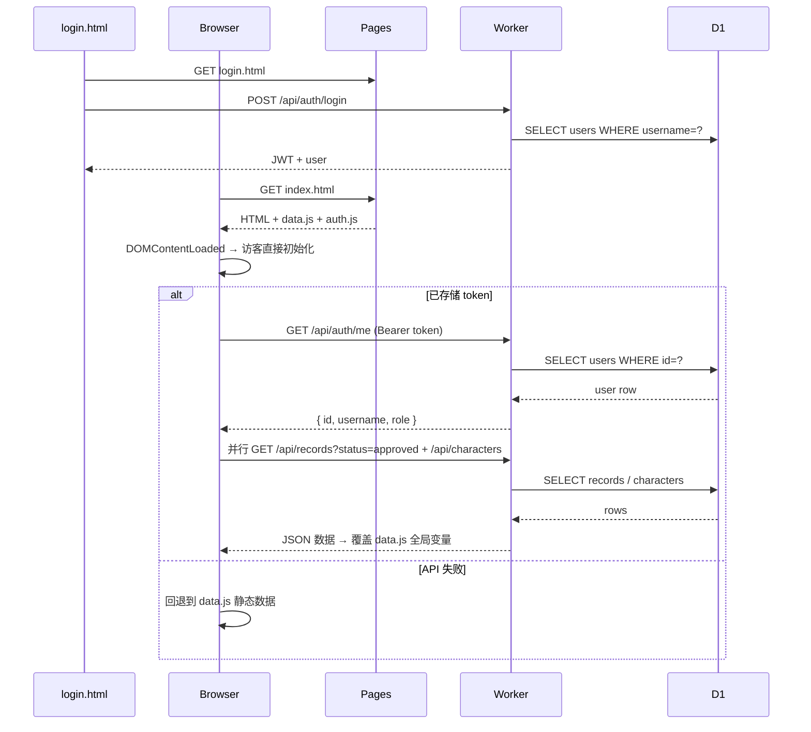
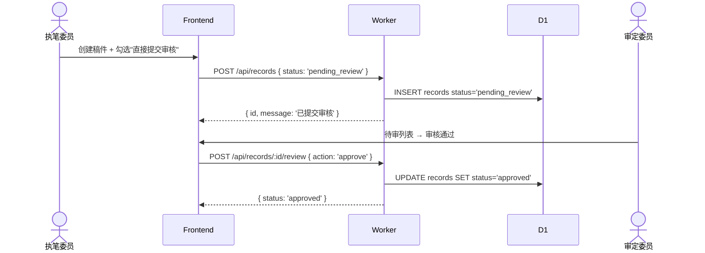
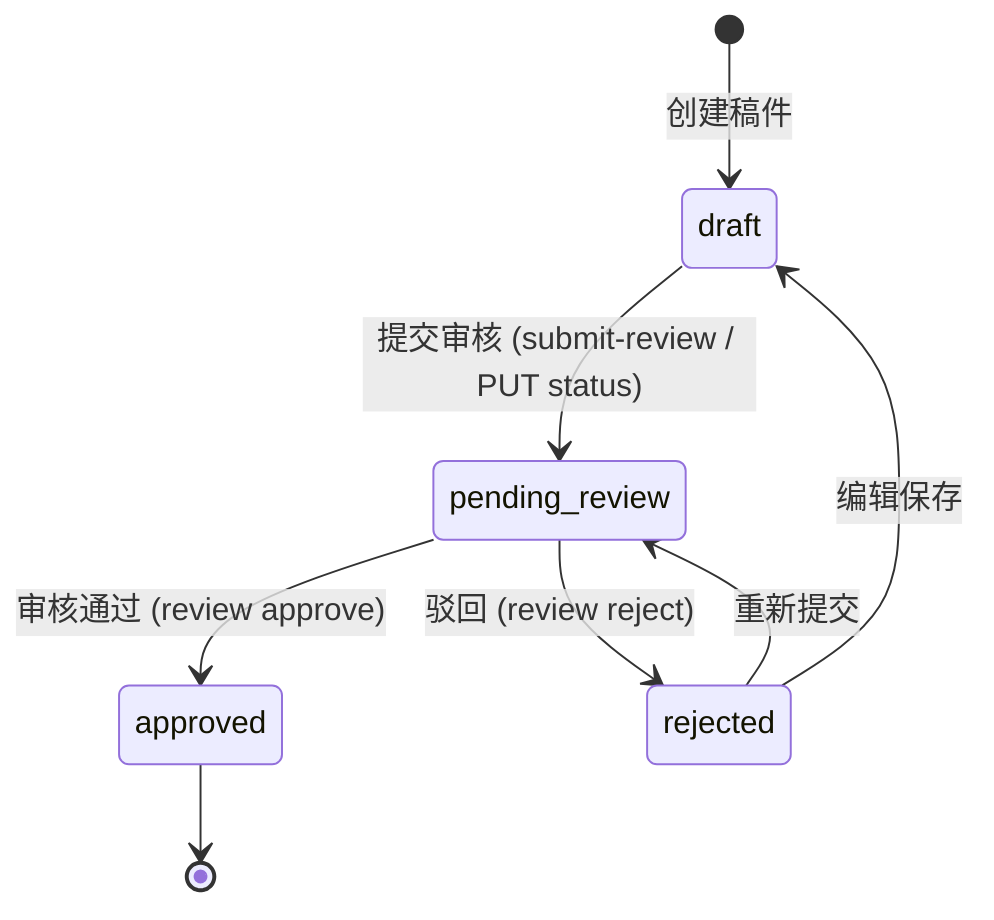
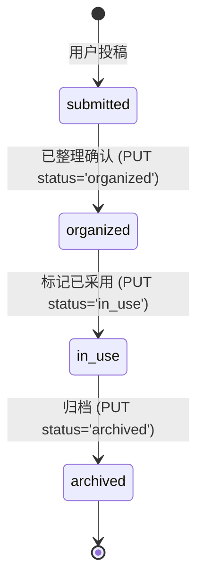

# Architecture

## Pattern Overview

Serverless 单服务 + 静态前端。Cloudflare Worker 承载 REST API，Cloudflare Pages 托管原生 HTML/CSS/JS 页面。无构建工具、无框架——主站、说明页、登录页和投稿页通过独立 HTML 路由提供，主站前端通过 `<script>` 标签按加载顺序协作，后端路由按 URL 前缀分发。架构以简单性和零冷启动为优先级。

## System Context

- **Browser** — 用户通过浏览器访问前端页面，JS 调用 API
- **Cloudflare Pages** — 托管静态资源 (history/)
- **Cloudflare Workers** — 运行 API 逻辑 (worker/src/)
- **Cloudflare D1 (SQLite)** — 持久化数据库，通过 Worker binding 访问
- **GitHub (qingranawa/15class-history)** — 源码仓库，Pages 通过 git push 自动部署

## Layering

### Frontend (`history/`) — 静态展示 + 管理面板
- 入口: `history/index.html`（班史）、`history/contribute.html`（投稿说明）、`history/joinus.html`（加入我们）、`history/guide.html`（新手指南）、`history/disclaimer.html`（免责协议）、`history/login.html`（登录）、`history/submit.html`（投稿） / `history/admin.html`（编纂委员）
- 数据: `history/data.js` (静态回退) → `history/auth.js` (登录 + API 数据) → `history/js/core/main.js` (应用启动)
- UI: `history/js/ui/render.js`（渲染）、`history/js/ui/modal.js`（弹窗）
- 功能: `history/js/features/stats.js`（统计）、`history/js/features/graph.js`（关系图）、`history/js/features/comments.js`（评论）
- 管理: `history/js/admin.js`（全部后台逻辑）
- 样式: `history/css/base/` → `history/css/layout/` → `history/css/components/` → `history/css/effects/`

### API Worker (`worker/src/`) — RESTful 后端
- 入口: `index.js` — URL 路径路由分发
- 认证: `worker/src/routes/auth.js` (login/register/me)
- 核心域: `worker/src/routes/records.js`（史事）、`worker/src/routes/characters.js`（人物）、`worker/src/routes/materials.js`（素材）
- 管理: `worker/src/routes/users.js`（用户、日志、配置）
- 基础设施: `worker/src/utils.js`（JWT/PBKDF2/CORS）、`worker/src/middleware.js`（认证、权限、审计）

### Database (`worker/schema.sql`) — D1 (SQLite)
- `users` / `records` / `characters` / `materials` / `audit_logs` / `system_config`

调用方向: Frontend → API Worker → D1。前端不直接访问 D1，Worker 不主动推数据到前端。

## Scenario Sequences

### 登录与数据加载

### 稿件审核流程

## Key Object FSMs

### Record Status

### Material Status

## Key Design Decisions

- **[全栈迁移至 Cloudflare Workers + D1]** — see ADR-001
- **[JWT HMAC-SHA256 + PBKDF2 密码哈希]** — see ADR-002
- **[静态数据回退层 data.js]** — see ADR-003
